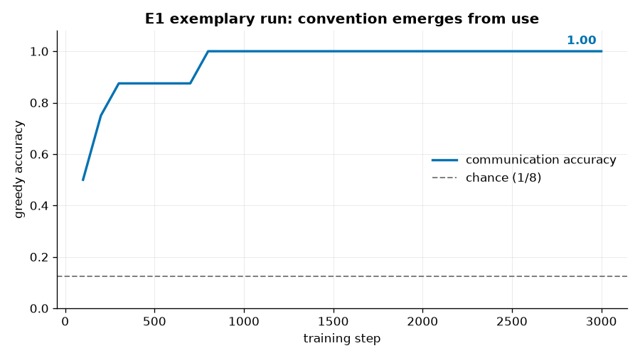

<!--
SPDX-License-Identifier: Apache-2.0
Copyright (c) 2026 Beetle-Box contributors
-->
# Exemplary run — E1 (convention from use)

A committed, fully-described representative run of **E1**, the Lewis signaling
game. This is the "here is what a good run looks like" reference. See the
[approach doc](../../../docs/e1_signaling.md) and the
[notebook](../../../notebooks/e1_signaling.ipynb).

## What produced it

The canonical E1 **baseline** condition (feedback on), default config, seed 0:

```bash
uv run python experiments/e1_signaling/run.py seed=0
uv run python -m beetlebox.analysis.e1 results/b6067ef6f269/seed0
```

| Setting | Value |
|---|---|
| Config hash | `b6067ef6f269` |
| Seed | `0` |
| Referents (`K`) | 8 (flat, one-hot) → chance = **0.125** |
| Channel | invented, `V=8`, `L=1` (bandwidth 8) |
| Agents | from-scratch `NeuralSender` (REINFORCE) + `NeuralReceiver` (CE) |
| Training | 3000 steps, batch 32, eval every 100 |

Full config and environment are in [`manifest.json`](manifest.json); the complete
event stream is in [`events.jsonl`](events.jsonl); the scored report is in
[`report.txt`](report.txt); and the step-by-step exchange transcript is in
[`transcript.txt`](transcript.txt).

## What happened



Communication accuracy rises from chance (0.125) to a stable **1.000**. A shared
convention emerged from feedback-driven use alone — no meanings were assigned in
advance.

| Metric | Value | Frozen threshold | Verdict |
|---|---|---|---|
| Final accuracy | **1.000** | ≥ 0.90 **and** ≥ 3×chance (0.375) | **PASS** (emergence) |
| Convention stability (last 5 evals) | **1.000** | ≥ 0.90 | **PASS** |
| Chance baseline | 0.125 | — | — |

The emergent **referent → message** convention is a clean bijection — each of the
8 referents maps to a distinct one of the 8 symbols:

| Referent | 0 | 1 | 2 | 3 | 4 | 5 | 6 | 7 |
|---|---|---|---|---|---|---|---|---|
| Symbol | s6 | s4 | s0 | s7 | s1 | s3 | s5 | s2 |

A maximally efficient code: every referent is unambiguously nameable, no symbol is
wasted or overloaded. The *particular* assignment is arbitrary (a different seed
yields a different permutation) — which is exactly the point. The meaning is in the
coordinated use, not in any symbol's intrinsic content.

### The convention forming, step by step

[`transcript.txt`](transcript.txt) shows the actual sender↔receiver exchange at
several checkpoints. You can watch collisions get resolved into agreement — e.g.
at step 300, referents 1 and 2 both still say `s4` (the receiver can't tell them
apart); by step 800 referent 2 has moved to its own symbol and all eight are
communicated. Regenerate it from the event log with:

```bash
uv run python -m beetlebox.analysis.transcript results/b6067ef6f269/seed0
```

## What it licenses

From the frozen pre-registration (reproduced in `report.txt`):

> Demonstrates the thin meaning-as-use thesis and establishes the baseline that
> later experiments perturb. It does **not**, by itself, say anything about
> "understanding," inner states, or whether the agents share a form of life. A
> stable convention here is public practice, nothing more. (`plan/beetle-box.md` §4.1)

For the companion conditions that make this result meaningful — the **ablation**
(no feedback → stays at chance), **turnover** (convention survives its founders),
and **compositional** grid runs — see the [notebook](../../../notebooks/e1_signaling.ipynb).

## Reproducing

Deterministic from `seed` + config. Re-running the command above reproduces this
run byte-for-byte in the metrics (`results/b6067ef6f269/seed0/`); the artifacts
here are a copy curated for reference.
