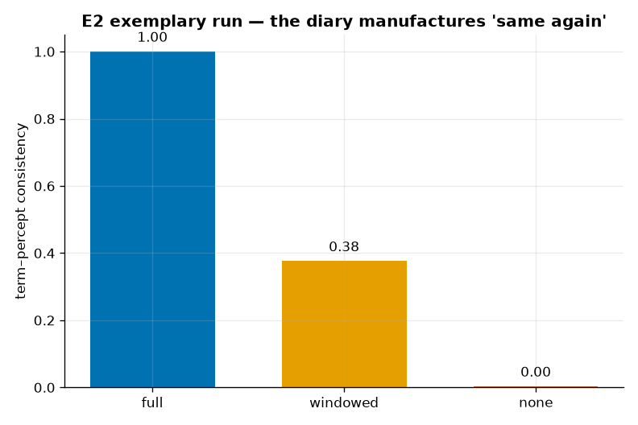

<!--
SPDX-License-Identifier: Apache-2.0
Copyright (c) 2026 Beetle-Box contributors
-->
# Exemplary run — E2 (the private diarist, §258)

A committed, fully-described representative run of **E2**, sweeping the diarist's
**memory access** — the central manipulation. See the
[approach doc](../../../docs/e2_diarist.md) and the
[notebook](../../../notebooks/e2_diarist.ipynb).

## What produced it

The `prototype` diarist naming a clean percept stream, seed 0, 2000 steps, one run
per memory condition:

```bash
uv run python experiments/e2_diarist/run.py -m diarist=full,windowed,none
uv run python -m beetlebox.analysis.e2 results/<config_hash>/seed0
```

| Setting | Value |
|---|---|
| Policy | `prototype` (match each percept against the diary of past impressions) |
| Types (`K`) | 6 → chance ≈ 1/6 |
| Percept | dim 8, noise 0.25 (clean "same again") |
| Memory | `full` / `windowed` (W=20) / `none` |
| Steps | 2000, seed 0 |

Per-condition raw artifacts are in [`full/`](full/), [`windowed/`](windowed/),
[`none/`](none/) (`events.jsonl` + `manifest.json`); the scored report for the two
poles is [`report.txt`](report.txt).

## What happened



| Memory | term–percept consistency | Reading |
|---|---|---|
| `full` | **1.000** | the diary lets every recurrence be named the same |
| `windowed` (W=20) | **0.38** | recent recurrences matched; distant ones scroll out |
| `none` | **0.00** | no diary → every sensation named afresh |

**Pre-registered checks** (`prereg/e2_diarist.yaml`, frozen):

- **stability_with_memory — PASS** (`full`): consistency 1.000 ≥ 0.90.
- **chance_without_memory — PASS** (`none`): consistency ≈ 0.00 ≤ 0.10.

**Memory produced the entire difference** between naming that is perfectly stable
and naming that never repeats. (The notebook additionally shows the windowed
"same again" fading with time gaps, and full-memory consistency collapsing as
percept noise makes recurrence genuinely ambiguous.)

## What it licenses

From the frozen pre-registration (reproduced in `report.txt`): this does **not**
refute Wittgenstein. The diary *manufactures* the stability §258 says is impossible
without an independent check — which forces the real question rather than settling
it: **is the diary an independent check, or a longer private impression?** The
diarist only ever checks its own past impressions against its present one; the
consistency number cannot tell a genuine criterion from a persuasive habit.

## Reproducing

Deterministic from `seed` + config. The artifacts here are curated copies of the
transient runs the commands above produce under `results/<config_hash>/seed0/`.
