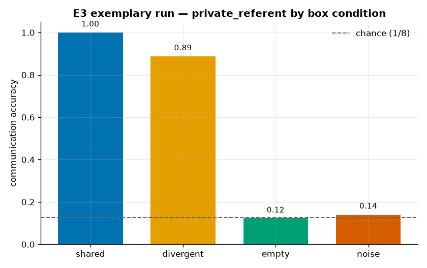

<!--
SPDX-License-Identifier: Apache-2.0
Copyright (c) 2026 Beetle-Box contributors
-->
# Exemplary run — E3 (the beetle-box, §293)

A committed, fully-described representative run of **E3**'s centerpiece game,
`private_referent`, swept across the four box conditions. See the
[approach doc](../../../docs/e3_design.md) and the
[notebook](../../../notebooks/e3_beetle_box.ipynb).

## What produced it

The `private_referent` discrimination game, seed 0, 3000 steps, one run per box
condition:

```bash
uv run python experiments/e3_beetle_box/run.py -m box=shared,divergent,empty,noise
uv run python -m beetlebox.analysis.e3 results/<hashShared>/seed0 results/<hashDivergent>/seed0 \
                                        results/<hashEmpty>/seed0 results/<hashNoise>/seed0
```

| Setting | Value |
|---|---|
| Game | `private_referent` (discrimination: receiver picks the target among all candidate boxes using the message) |
| Referents (`K`) | 8 → chance = **0.125** |
| Channel | invented, `V=8`, `L=1` |
| Box | `box_dim=16`, conditions `shared` / `divergent` / `empty` / `noise` |
| Agents | from-scratch `NeuralSender` + `DiscriminationReceiver` |
| Training | 3000 steps, seed 0 |

Per-condition raw artifacts are in [`shared/`](shared/), [`divergent/`](divergent/),
[`empty/`](empty/), [`noise/`](noise/) (`events.jsonl` + `manifest.json`); the scored
report is [`report.txt`](report.txt); the exchange transcript is
[`transcript.txt`](transcript.txt); the no-leak check is [`ablation.txt`](ablation.txt).

## What happened



| Condition | Accuracy | Reading |
|---|---|---|
| `shared` | **1.000** | shared code between agents → coordination |
| `divergent` | **0.887** | works too, but the receiver must learn a cross-code translation |
| `empty` | 0.122 | sender blind → chance |
| `noise` | 0.141 | random box → chance |

**Pre-registered checks** (`prereg/e3_beetle_box.yaml`, frozen v2):

- **Earnable-cancellation — PASS.** Informative boxes (mean 0.944) beat `empty`
  (0.122) by 0.82. The box demonstrably carries the signal; the cancellation is
  *found*, not assumed.
- **Beetle gap** (shared − divergent) = **0.113 → "shared inner state helps"** at
  this training budget: with genuine communication, a shared code is easier than a
  divergent one (which forces the receiver to learn a translation). The private
  *form* affects how hard coordination is to learn — not, on this evidence, whether
  it is achievable (divergent still reaches 0.89).

### The no-leak guard

[`ablation.txt`](ablation.txt) records the channel decomposition for `shared`:

```
full communication    : 1.000
MESSAGE zeroed        : 0.156   (~chance 0.125)
receiver boxes zeroed : 0.156
```

With the public message removed, accuracy collapses to chance — so the sender→
receiver channel is genuinely carrying the meaning. This guards against the
receiver-side leak an earlier design had (see the design doc's history note); the
result is real communication, not an agent reading its own box.

## What it licenses

From the frozen pre-registration (reproduced in `report.txt`): E3 turns the core
claim of §293 into a number. It does **not** settle whether the agents "have" inner
states or what they are like — the four conditions are *our* God's-eye control; the
agents never get one. That asymmetry is the point.

## Reproducing

Deterministic from `seed` + config. The artifacts here are curated copies of the
transient runs the commands above produce under `results/<config_hash>/seed0/`.
