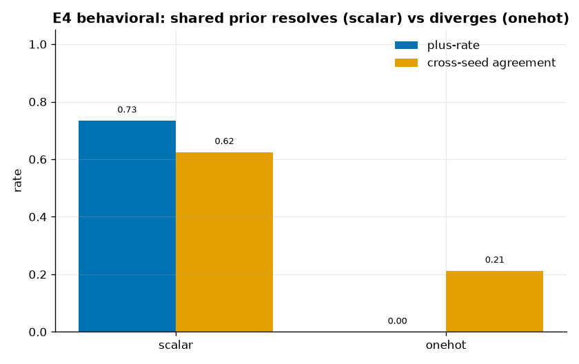
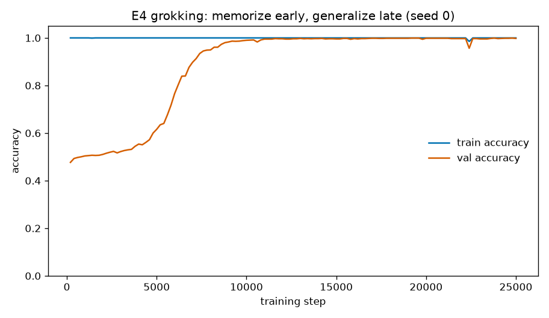
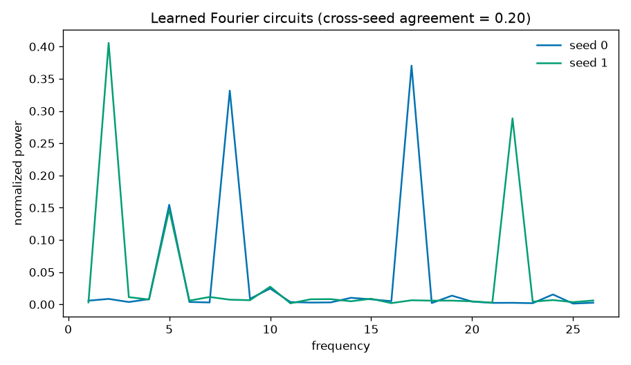

<!--
SPDX-License-Identifier: Apache-2.0
Copyright (c) 2026 Beetle-Box contributors
-->
# Exemplary run — E4 (quus / rule-following)

Committed, fully-described representative runs of **both E4 layers**. See the
[approach doc](../../../docs/e4_quus.md) and the
[notebook](../../../notebooks/e4_quus.ipynb).

E4's payload is the **gap** between the two layers: behavioral underdetermination
above, mechanistic non-determinacy below.

---

## Layer 1 — Behavioral ([`behavioral/`](behavioral/))

Seeded students (8) trained only on below-bend quus pairs, extrapolating above the
bend, under two operand encodings:

```bash
uv run python experiments/e4_quus/run.py -m quus=scalar,onehot
uv run python -m beetlebox.analysis.e4 results/<config_hash>/seed0
```



| encoding | plus_rate | cross-seed agreement | verdict |
|---|---|---|---|
| `scalar` | **0.73** | **0.63** | shared prior resolves toward plus — **PASS** `shared_prior_resolves` |
| `onehot` | **0.00** | **0.21** | underdetermination unresolved — **PASS** `underdetermination_visible` |

Divergence (one-hot) makes Kripke's underdetermination visible; convergence
(scalar) shows a shared inductive prior quietly resolving it. Neither *settles*
which rule is correct. Scored report: [`behavioral/report.txt`](behavioral/report.txt);
raw artifacts under [`behavioral/scalar/`](behavioral/scalar/) and
[`behavioral/onehot/`](behavioral/onehot/).

## Layer 2 — Mechanistic ([`mechanistic/`](mechanistic/))

Two from-scratch transformers (seeds 0 and 1), identical data, trained to grok
`(a + b) mod 53` (d_model 128, weight decay 1.0, 25 000 steps each):



**Both seeds grok:** train accuracy saturates by ~step 200 (memorization) while
val accuracy lags for thousands of steps, then climbs to ~1.0 (**seed 0: 0.998,
seed 1: 0.996**) — the memorize→generalize transition. The parameter norm (a
description-length proxy) falls over training (43.5 → 30.7), the complexity drop
that accompanies generalization.



But the two models learn **different algorithms**. Each concentrates its embedding
Fourier power in a few key frequencies — seed 0 in **{17, 8, 5}**, seed 1 in
**{2, 22, 5}** — sharing only frequency 5, for a **cross-seed algorithmic
agreement of 0.20**. Two networks trained on identical data, both perfectly
correct, implement the task with different circuits — "The Clock and the Pizza."

Full numbers: [`mechanistic/report.json`](mechanistic/report.json); training
histories: `mechanistic/history_seed{0,1}.json`.

> The mechanistic layer is a **launch-it-deliberately** job (~15 min for both
> seeds), not part of the fast test/notebook path. These artifacts are a real grok,
> committed for reference.

## What it licenses

E4 does **not** resolve Kripke's skepticism. Behaviorally, convergence is a shared
prior selecting one of infinitely many admissible rules — a longer finite fact, not
an independent criterion. Mechanistically, opening the box does not dissolve the
skepticism either: the circuit is itself a longer finite fact, and two models need
not even agree on which circuit. The result is the **gap** between behavioral
underdetermination and mechanistic non-determinacy, relocated onto examinable
ground. (`plan/beetle-box.md` §4.4)
