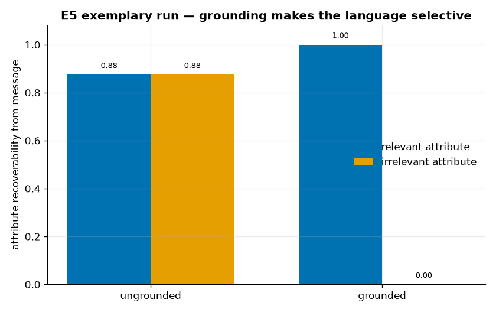

<!--
SPDX-License-Identifier: Apache-2.0
Copyright (c) 2026 Beetle-Box contributors
-->
# Exemplary run — E5 (forms of life / grounding)

A committed, fully-described representative run of **E5**, the capstone: the same
signaling game run **grounded** vs. **ungrounded**. See the
[approach doc](../../../docs/e5_forms_of_life.md) and the
[notebook](../../../notebooks/e5_forms_of_life.ipynb).

## What produced it

```bash
uv run python experiments/e5_forms_of_life/run.py -m experiment=e5_grounded,e5_ungrounded
uv run python -m beetlebox.analysis.e5 results/<config_hash>/seed0
```

| Setting | Value |
|---|---|
| Referents | grid, 2 attributes × 4 values = **16** |
| Channel | invented, `V=6`, `L=2` |
| Grounded | receiver acts; payoff depends on the *relevant* attribute (0), **stakes** set by the *irrelevant* attribute (1) |
| Ungrounded | reward = identify the referent (E1) |
| Training | 4000 steps, seed 0 |

Per-regime raw artifacts are in [`grounded/`](grounded/) and
[`ungrounded/`](ungrounded/); the scored report is [`report.txt`](report.txt).

## What happened



| regime | performance | lexicon | relevant recover. | irrelevant recover. | selectivity gap |
|---|---|---|---|---|---|
| **ungrounded** | 0.938 (id acc) | 15/16 | 0.88 | 0.88 | **0.00** |
| **grounded** | 1.000 (payoff) | 4/16 | 1.00 | 0.00 | **1.00** |

Same referents, same channel — but the **character of the language differs
completely**. The ungrounded language encodes **full identity** (a near-unique
message per referent; both attributes recoverable). The grounded language is
**selective**: a handful of messages, one per payoff-relevant value, with the
irrelevant attribute *entirely discarded*.

**Pre-registered checks:** `grounding_is_selective` — **PASS** (gap 1.00 ≥ 0.50);
`encodes_full_identity` — **PASS** (gap 0.00 ≤ 0.20, recoverability 0.88 ≥ 0.60).

(Secondary metrics in `report.txt`: both regimes transfer fully to a fresh receiver
after turnover; both degrade under channel noise.)

## What it licenses

Grounding measurably changes the character of the emergent language — evidence the
**form of life is load-bearing**: the surrounding activity, not the tokens alone,
shapes what the language marks. It does **not** show the agents "understand"
anything, nor that an ungrounded language could never be pushed to behave the same
under a different pressure — it shows that under this grounding the structure is
different, and why. (`plan/beetle-box.md` §4.5)

## Reproducing

Deterministic from `seed` + config. The artifacts here are curated copies of the
transient runs the commands above produce under `results/<config_hash>/seed0/`.
