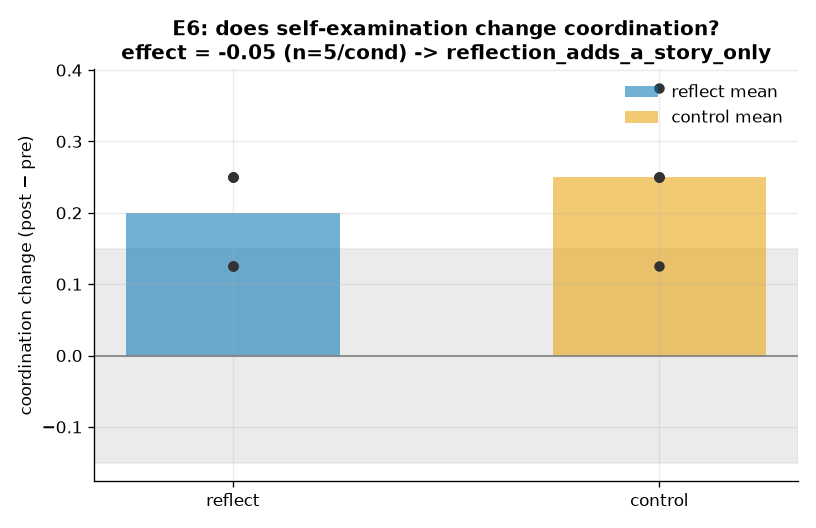

<!--
SPDX-License-Identifier: Apache-2.0
Copyright (c) 2026 Beetle-Box contributors
-->
# Exemplary run — E6 (the reflexive layer)

A committed, fully-described representative run of **E6**, the finale: two frontier
agents coordinate, then are turned to examine their own coordination. See the
[approach doc](../../../docs/e6_reflexive.md) and the
[notebook](../../../notebooks/e6_reflexive.ipynb).

## What produced it

Rich mode (frontier agents), Haiku, **5 seeds per condition** so a single noisy run
cannot drive the verdict:

```bash
uv run python experiments/e6_reflexive/run.py -m intervention=reflect,control
uv run python -m beetlebox.analysis.e6 --reflect results/<r>/seed0 ... --control results/<c>/seed0 ...
```

| Setting | Value |
|---|---|
| Model | `claude-haiku-4-5` |
| Coordination game | reference game, 4 referents, `V=6` symbols |
| Blocks | 8 rounds pre + 8 rounds post |
| Intervention | `reflect` (examine shared meaning) vs `control` (matched neutral interlude) |
| Seeds | 0–4 per condition |
| Cost | ~$0.19 (340 Haiku calls) |

Per-seed raw artifacts are under [`reflect/seed*/`](reflect/) and
[`control/seed*/`](control/); the scored comparison is [`report.txt`](report.txt) /
[`report.json`](report.json). The reflection text is in
[`reflection_transcript.txt`](reflection_transcript.txt) — **for the record only; it
is not an input to scoring** (see the prereg).

## What happened



| condition | per-seed Δ (post − pre) | mean Δ |
|---|---|---|
| `reflect` | 0.25, 0.25, 0.125, 0.125, 0.25 | **+0.20** |
| `control` | 0.25, 0.25, 0.25, 0.125, 0.375 | **+0.25** |

**reflection_effect = mean_delta(reflect) − mean_delta(control) = −0.05**, well
within the frozen null band (±0.15). **Verdict: `reflection_adds_a_story_only`.**

Both conditions improve over the intervention (the agents keep learning the code
across the second block), and self-examination confers **no advantage over a neutral
interlude**. The `reflect` agents produced fluent first-person statements about
shared understanding (see the transcript) — and the coordination did not move
relative to control. **The meta-example's irony (plan §1), reproduced in the third
person and as a number: the story appears; the practice is untouched.**

> A single small run of this experiment drifted *outside* the band on one round of
> noise; the seed-averaged estimate here reverses to the robust null. That fragility
> is exactly why the metric is control-subtracted and seed-averaged, and why the
> transcripts are excluded from scoring.

## What it licenses

E6 does **not** adjudicate the deflationary vs. form-of-life readings — from inside
the exchange they are indistinguishable, which is the point. It reports one thing:
whether an agent examining its own coordination changed that coordination relative
to a matched control (here: no). Reading the reflection transcript as evidence of
shared meaning is precisely the over-reading the frozen pre-registration forbids.
(`plan/beetle-box.md` §1, §3.2, §4.6)

## Reproducing

Deterministic from `seed` + config given identical model responses; the frontier
model introduces run-to-run variation, which is why the estimate is averaged over
seeds. Artifacts here are curated copies of the transient runs.
